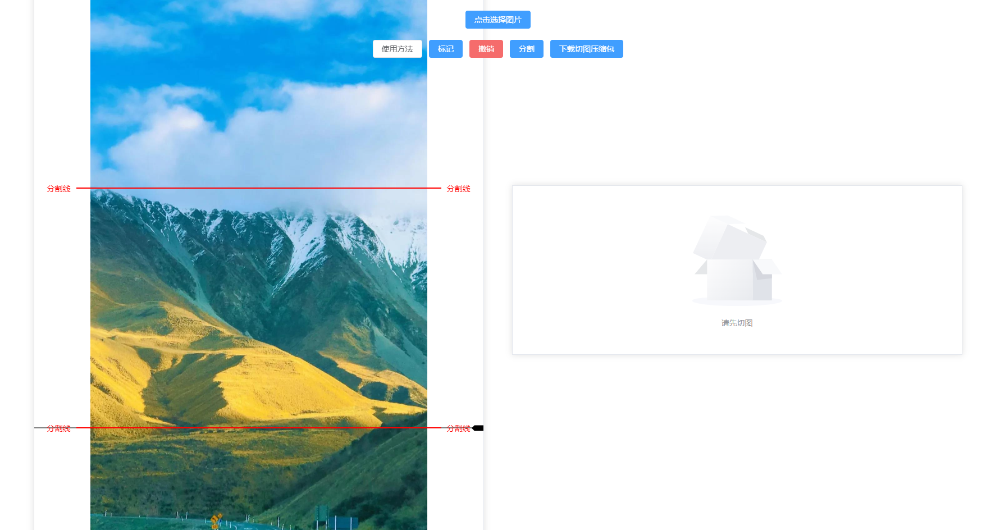
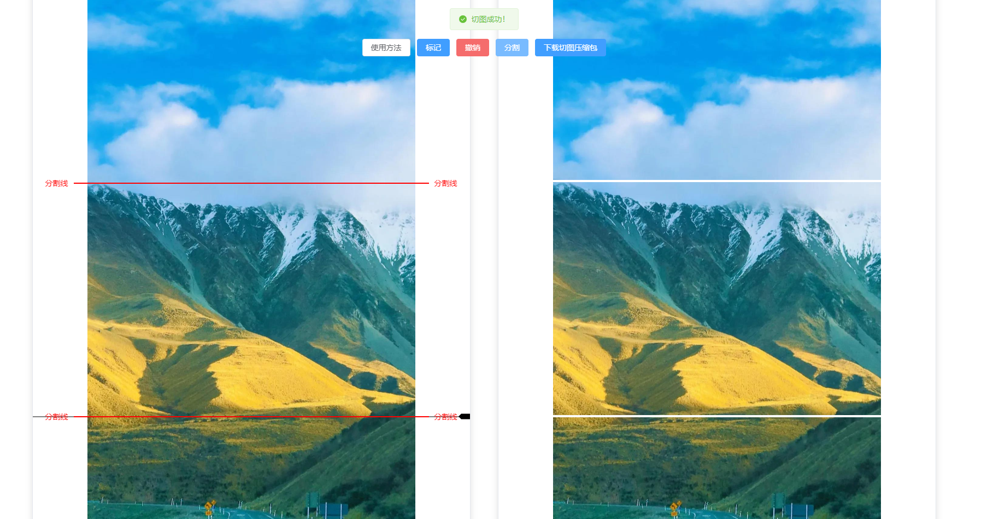

# 长图片自由分割/切割在线工具

在线体验：
https://long-pic-cutter.pages.dev

## 项目介绍

本项目是 [wumingluren/LongPicCutter](https://github.com/wumingluren/LongPicCutter) 的一个 fork。本工具旨在提供一个简单易用的在线解决方案，用于将长图片或多张图片/PDF 页面拼接后的长图进行自由分割。

**主要功能：**

- **多种上传方式**：
  - 支持选择单张图片 (JPG, JPEG, PNG)。
  - 支持同时选择多张图片，工具会自动将它们按选择顺序纵向拼接成一张长图。
  - 支持选择单个 PDF 文件，工具会自动提取 PDF 中的每一页，并将它们纵向拼接成一张长图（页面清晰度已优化）。
- **灵活标记**：通过拖动或直接点击预览图的方式移动引导线，然后在目标位置进行标记。
- **自由分割**：根据标记位置将图片分割成多个部分。
- **批量下载**：将分割后的所有图片打包成 ZIP 文件下载。
- **纯前端实现**：所有操作均在浏览器本地完成，无需上传图片到服务器，保障隐私安全，无需网络也可操作（首次加载页面除外）。

##### 使用技术

Vue3, element-plus, file-saver, jszip, pdfjs-dist

## 使用方法

1.  点击"选择图片"按钮：

    - **选择单个图片文件** (JPG, JPEG, PNG)。
    - **选择多个图片文件**：这些图片将按选择顺序自动纵向拼接成一张长图。
    - **选择单个 PDF 文件**：PDF 的所有页面将自动转换为图片并纵向拼接成一张长图。
      处理完成后，图片将在左侧预览区展示。

2.  在左侧预览区，您可以通过**直接点击目标位置**或**拖动黑色引导线**的方式，将其移动到您希望分割的地方。然后点击"标记"按钮，会在引导线当前位置生成一条红色标记线。

3.点击 "分割" 按钮开始分割，并在右侧将预览图展示出来

4.点击 "下载切图压缩包" 按钮即可下载分割好的图片压缩包

5.点击 "撤销" 按钮可撤销最近一次标记

6.点击 "重置" 按钮可重置（暂时没做，手动 F5 刷新）

## 演示图

 图一 

 图二 

## 地址

长图片自由分割/切割在线工具

在线体验：
https://long-pic-cutter.pages.dev

源码地址：
https://github.com/BenedictKing/LongPicCutter
